# Design report SEGFAULT

## System design
The project specification asked us to create a reference counter program that enables C, which uses manual memory management, to become automatic. We accomplished this by adding several functionalities into our refmem.c file that would manage memory usage without needing the user to use the normal memory functions of C, such as free(), alloc() and malloc(). The program works by having each object contain a reference counter that keeps track of all the pointers to that specific object. If that object’s personal reference counter is zero that in turn means that this object is no longer being used and can safely be freed.

### Static list
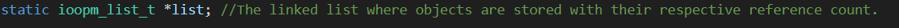
To keep track of all the objects and their reference counters we created a static linked list, that is unavailable to the user. This list is created contains all objects that have been allocated to make it easier for the cleanup function later on to remove any objects that are no longer used. This list is created before the start of the program and destroyed when the program stops.

### Struct for the reference counter
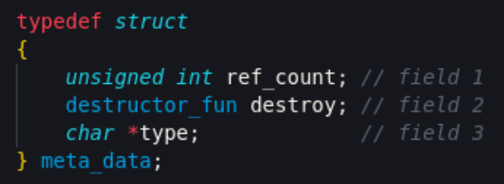
In our design the reference counter needs to keep track of three data types. The first being an unsigned int, unsigned because we are not interested in negative reference counts. This enables a reference count of up to 4,294,967,295. This was our initial struct and 4 bytes is probably a bit overkill but due to time constraints, we have decided to stick with that. The second type is a pointer to a destructor function which will take up 4/8 bytes (system dependant). The third type is a pointer to a string that is used when allocating memory from types registered by the user. We would probably not have to allocate memory for the third field unless we are using that feature so this is something that could be improved.

### Metadata
The data of the previously mentioned struct is what we call the metadata of an object. When a user wants to allocate memory for an object the system will ask for a memory block big enough for the bytes of the metadata, and the bytes asked from the user for the object. Hence, storing the metadata at the address right before the object on the heap and giving each object its own unique metadata.

### Object to meta data, and meta data to object
To easily translate between an object and the metadata, we have implemented two simple functions. The functions offset the address of a given pointer, with the size of the metadata. This improves readability and enables easy swapping between objects and its respective metadata. These are private functions and are only used within the library.
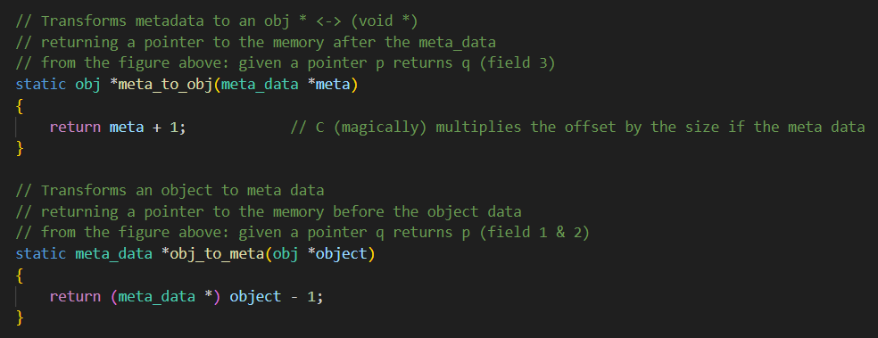

### Allocate and allocate arrays
We also created functions for allocating memory for objects with allocate() and allocate_arrays().
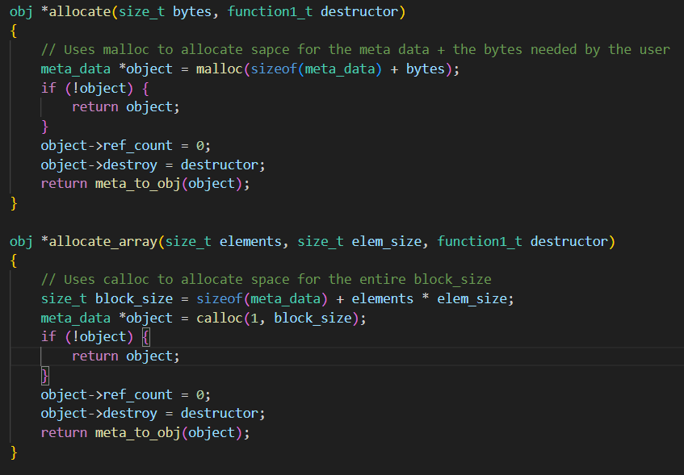
When allocating memory for our data make use of C’s standard memory allocating functions. The total size of memory needed is size of our meta_data struct + the number of bytes provided by the user. For each allocation we will add 12/20 bytes (system dependant) to the original numbers of bytes asked for.

### Startup and shutdown
To ensure that the global linked list is created when loading the library, we used an attributes constructor for the startup function. This function initiates the global linked list that is used to save objects. The attribute constructor makes this function run before the main function of the program, meaning that it is not necessary that the user calls the startup function manually.

Without this attribute we could not safely assume that the list would be created before the program started.
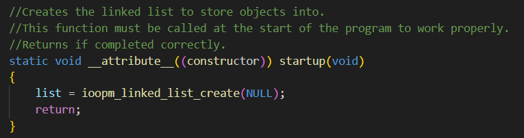

### Release and retain
To control the reference count of objects we implemented the functions release and retain. The purpose of these functions is to decrease or increase the reference count of the given object. These follow the functional requirements of the project

* If release() is called on an object with a reference count of 1, the object is considered garbage and shall be free’d.

* Calling retain() and release() on NULL is supported and should simply be ignored.

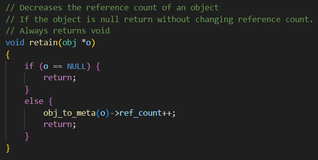
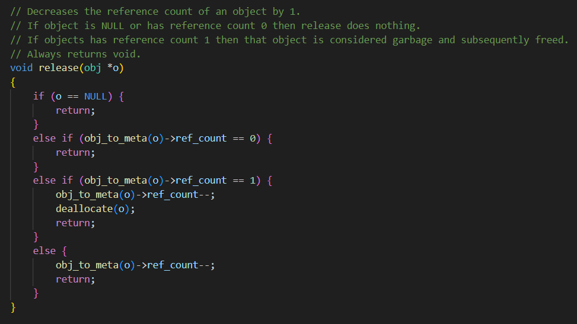

### Reference count
In our design we have taken the decision to return –1 if rc with NULL. This is to prevent random reads in the memory. If the object is a valid pointer, we access the metadata and return its reference count.
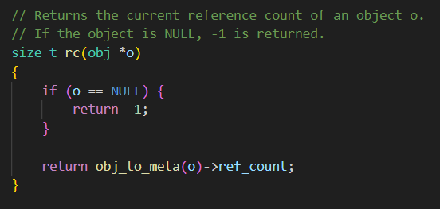

### Deallocate
The deallocate function is the main “garbage removal” function of the program. It aims to call the destructor before freeing an object. Only an object with reference count 0 are allowed to be freed. Objects that do not have a destructor will not invoke that function. It will however be freed.
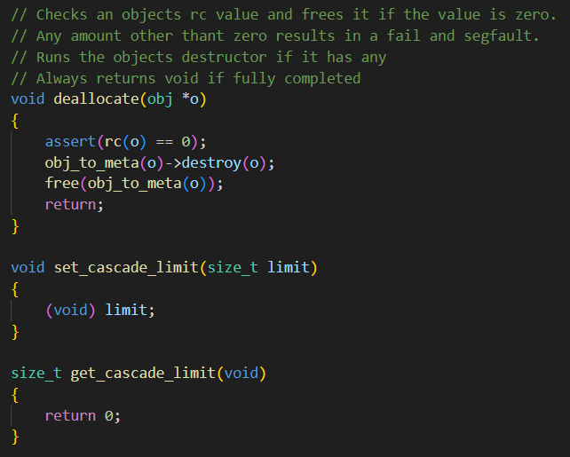

### Cleanup
To free garbage (non-freed objects with reference count zero) cleanup loops through the global list and removes all objects with reference count zero. If the list contains no objects or the objects all have a reference count above zero, then the functions does nothing.
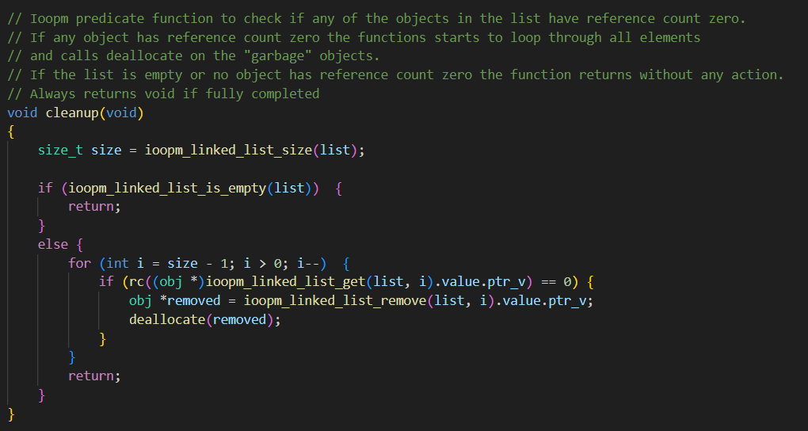

### `get_cascade_limit` and `set_cascade_limit`
A part of this project was to implement a cascade limit. The purpose of this was to prevent deallocating too many objects at once, which would cause performance issues. The functions set_cascade_limit and get_cascade_limit were implemented for this. The set_cascade_limit function set a global variable, cascade_limit, and get_cascade_limit retrieved the value of the variable.

Apart from adding the cascade limit functions, the functions allocate, allocate_array, and deallocate required an update to support the cascade limit. This was achieved by a function called dealloc_mem with a helper function named dealloc_mem_helper. Moreover, a global linked list, dealloc_list, was used to store outstanding memory deallocations. In the deallocate function, the reference count of the object was released to 0 to ensure it was ready for deallocation. This object was then stored in the linked list before the dealloc_mem function was called. The dealloc_mem function and its helper function ensured that objects from the linked list were deallocated using free() whilst respecting the cascade limit. The startup function was used to set a default cascade limit (10.) The global linked list is torn down in the shutdown function.

Aside from respecting the cascade limit, it was important that sufficient memory was deallocated to ensure allocations work properly. The dealloc_mem function was used for this purpose too. To ensure that the function could be used both for allocation and deallocation, since they should execute the same process, a parameter "requested" was added to the function signature. This parameter signified how many bytes were required. For deallocation, this would be 0.

Unfortunately, this piece of the code was delayed severely due to lack of communication. There were several questions pending for an answer, which required further input before the code could be written. According to the members who reviewed the code, the logic works. Unfortunately, it caused memory leaks. Because of time constraints, these cannot be resolved before the deadline. Moreover, tests were not written since the member responsible for this awaited the finished code instead of preparing tests in advance (a test-driven approach.) Due to the issues, the pull request has not been merged with the main branch.

#### Reference code

##### Global variables:
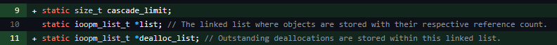

##### `startup` function:
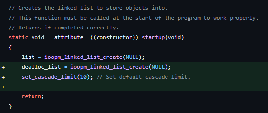

##### `dealloc_mem_helper` function:
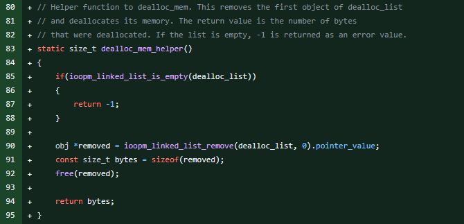

##### `dealloc_mem` function:
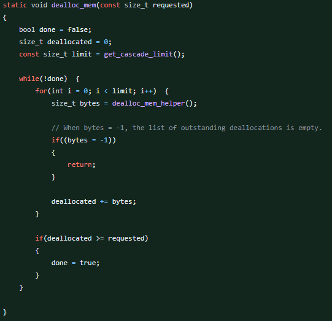

##### `allocate` function updates:
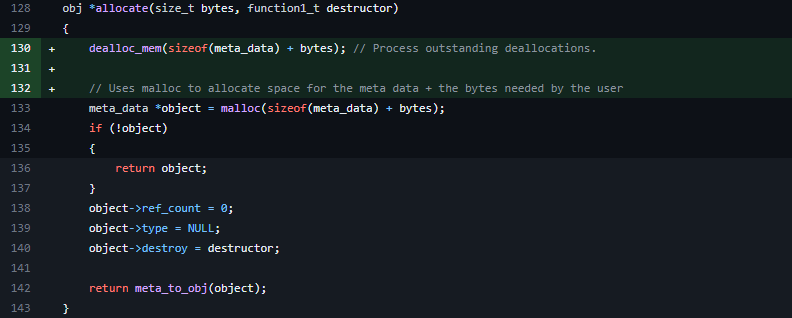

##### `allocate_array` function updates:
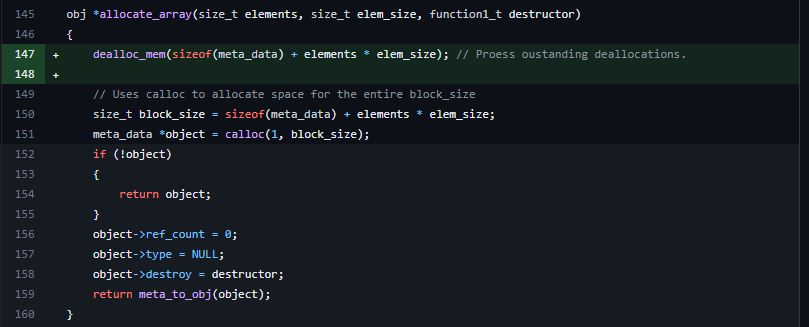

##### `deallocate` function updates:
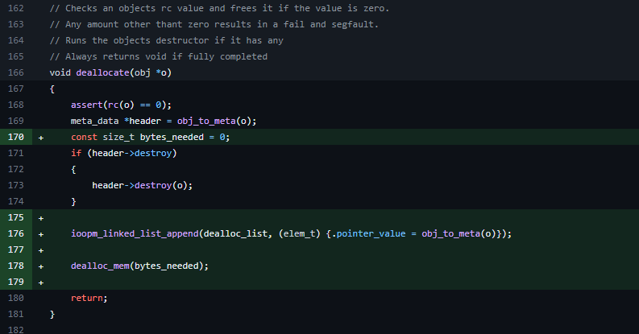

## Typemem library
To enable the functionality of a default destructor we’ve implemented another library that builds on the original refmem library.  This adds on to the original implementation and enables for a user to register offsets in a type, where there could be pointers to other objects. At the startup of the library a global hash table is created.  The registered types are stored in the global hash table with the name of the types as the keys and the size and offsets as the values. The total size is required when a user wants to allocate from a registered type. When the library shuts down the hash table will be destroyed, and all entries will be freed.

### Register type
#### Preprocessing
The register type function takes the name of a type and the names of the fields of a type that contains pointers. It is currently limited to 10 offset fields. To get the size, name and offsets this call is converted with the help of C macros to the real function call

Ex: for a struct of a linked list with a first and last pointer:

register_type(linked_list, first, last) -> __register_type(“linked_list”, 16, 2, 0, 8)

Note: the third parameter is the number of offsets (see next section).

#### Function
The real function makes use of the C library stdarg.h to enable argument overloading. This is the reason we need the counter for the offsets. The name, size and offsets are then sent to a helper function that inserts all numbers to a linked list and inserts it to the global hash table with the name as the key

Ex: linked_list: [16, [0, [8, NULL]]]

### Allocate from type
When allocating from a registered type we’ve made a function like allocate. The key difference is that the number of bytes to allocate gets extracted from the first element of the linked list stored in the hash table for that specific type. This also uses C macros to match the syntax of register type.

Ex: allocate_from_type(linked_list) -> __allocate_from_type(“linked_list”)

To enable the use of the default destructor we insert the type name, and a pointer to the default destructor function in the metadata of the allocated object.

### Default destructor
The default destructor takes an object as argument. It retrieves the type field in the meta data of the object. This is used as the key to get the offsets from the global hash table. For each offset release is called.

### Algorithm

#### Default destructor
- Convert the object to its metadata representation 
- Read memory offsets from the hash table 
- For each offset 
  - Calculate the address to release 
  - Release the object at the calculated address

#### Cascading free’s
The functionality of handling cascading free’s were never implemented as mentioned in the deviations section. However, the following is the idea for how it would have worked. 

Initializing:
- Initialize a cascade limit variable  
- Create a global list for outstanding free’s 

Freeing:
- When freeing an object, check if the cascade limit has been reached. 
- If the cascade limit has not been reached, free the object immediately. 
- If the cascade limit has been reached, add the object to the queue for outstanding free’s,  

Allocating:
- When a new object needs to be allocated, check if there are any outstanding frees pending. 
- If the memory requested is bigger than the memory of the outstanding free’s. Free without respecting the cascade limit 
- Else, free all objects in the queue with respect to the cascade limit

### Modules
We decided to use the given directories to split up our modules. In our main directory “SEGFAULT” we use four subdirectories that contains everything from the demo, reports, source code and tests. These modules allow us to separate the main parts of the program into individual directories that are easier to work with. When working with different people it also helps to have different modules where people can work in parallel.

### Data structures
Throughout the program we use the static linked list as stated before, but we also implemented a new data structure in metadata.  We made use of an iterator in cleanup and shutdown where we iterated over the linked list to modify the objects.

The destructor uses a personal hash table to register data types. This data structure is not available to the rest of the program as no other functions makes use of it, so we kept it private to the destructors. 

### Deviations
Because of time constraints there were some features that we could not implement in time. One of those features are the tests for the program. We have some tests, but we were not able to achieve 100% code coverage. All we need to solve this is time as that was what caused the deviation in the first place. Part of this is because some of the functions edge cases could not be tested safely. For example, the only way we found to certainly test that malloc returns null for our edge case was to overflow the memory of the computer so that there is no more space to allocate. We did not feel that it was necessary to provide a test for this since it would hard to replicate and possibly harmful to the computer.

The program is also missing support for cascading frees, and the functionality of getting and setting the cascade limit. The code for this is mainly done but not implemented due to introduced bugs that we did not have time to tend to.

As a result of this the tests for cascade limit were not finished.  We believe that writing tests for cascade limit would not be that hard, since we know how the cascade limit would work together with the other functions that have already been tested. With more time we feel confident that we could provide sufficient tests and implementation of the cascading free functionality.
