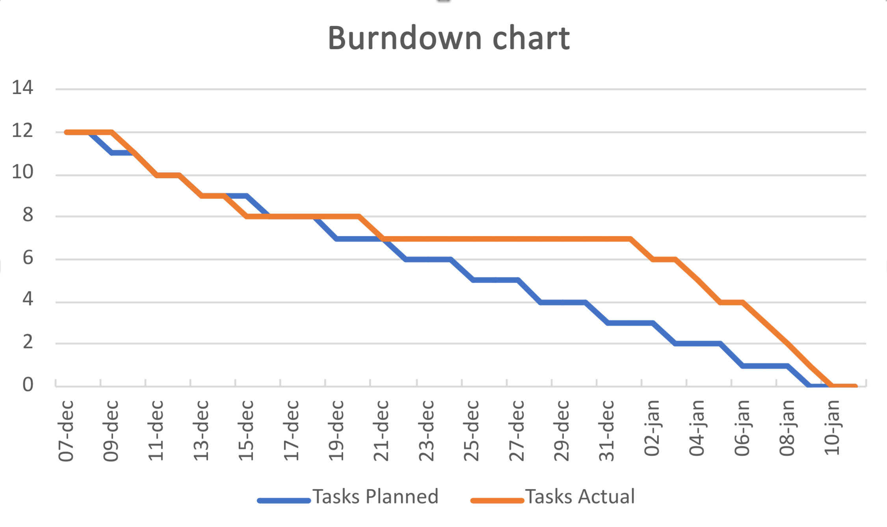
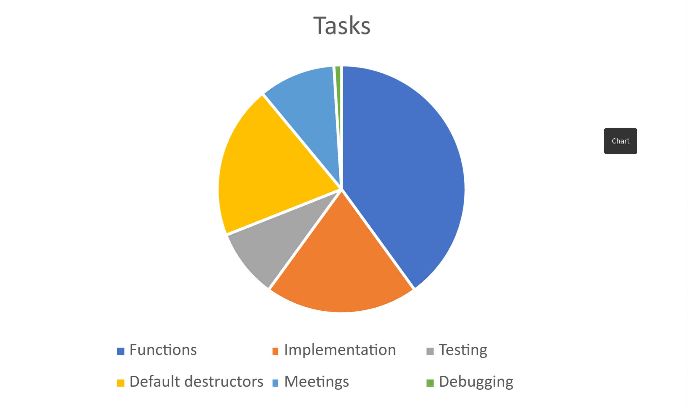

# Project report SEGFAULT

#### Table of contents

1. [Group name](#group-name)
    - [Participant list](#participant-list)
2. [Quantification](#quantification)
3. [Process](#process)
    - [Inception](#inception)
    - [Implementation](#implementation)
4. [Use of tools](#use-of-tools)
5. [Communication, cooperation and coordination](#communication-cooperation-and-coordination)
6. [Work breakdown structure](#work-breakdown-structure)
7. [Reflections](#reflection)

## Group name
SEGFAULT

### Participant list
| Name                      | Email                           | Active dates      |
|---------------------------|---------------------------------|-------------------|
| Ivar Jensen               | Ivar.jensen.9902@student.uu.se  | 5/12/23 – 12/1/24 |
| Jesper Borglund Vannebäck | Jeva.3694@student.uu.se         | 5/12/23 – 12/1/24 |
| Erik Junsved              | Erik.junsved.7396@student.uu.se | 5/12/23 – 12/1/24 |
| Kevin Öberg               | kevin.oberg.2976@student.uu.se  | 7/12/23 - 12/1/24 |
| Tommy Komo                | Tommy.komo9120@student.uu.se    | 5/12/23 - 12/1/24 |

## Quantification
- Project start date
  - 5/12-23
- Project end date
  - 11/1-24
- Number of sprints, start and finish
  - 3
    - Sprint 1: 7/12 - 15/12
    - Sprint 2: 15/12 - Christmas break
    - Sprint 3: New year – 11/1
- Total lines of new code (excluding tests)
  - 493
- Total lines of test code
  - 285
- Total lines of “script code”
  - 241
- Total number of hours worked
  - 145
- Total number of git commits
  - 66
- Total number of pull requests
  - 26
- Total number of GitHub issues
  - 1

## Process

### Inception
During the first and second group meetings we discussed the different processes that were available. We gave each member as a task between the meetings to read up on each of the processes and on the second meeting we decided which process to use throughout the whole project. Unfortunately, every member was not present at these meetings, but we had enough people that we felt that the process that we picked would work for the whole group. In the end we chose scrum as our desired process since we felt it gave us the structure that we needed to divide up the workload evenly and set clear and concise time parameters for the project. The normal scrum process uses daily meetings to discuss what everyone has done, and what they plan to do until the next meeting. Since a few of our group members where, working from home we decided to only have three meetings per week, Monday, Wednesday and Friday. On the meetings we would partly implement the flow of a normal scrum meeting. We would discuss how everyone is coming along with their work, who might need more time or assistance in order to be finished on time, and if anyone needed some code from another group member in order to complete their assignments. This process worked well in the beginning but due to the Christmas break landing in between the start and end of the project the meetings became less and less frequent.

### Implementation
We took what we learned about the scrum process and changed it to fit our goals and needs of this project. Me decided to only have three meetings per week instead of the normal daily meetings. This made each meeting longer and contain more information to be brought up but allowed us to schedule the meetings easier in accordance with everyone’s schedule.

If we were to redo the project, we would definitely put more emphasis on the meetings, and require everyone to be present at as many meetings as possible. We would also plan some short meetings during Christmas break in case anyone felt that they needed to discuss something. It did not have to be three meeting a week during the break, but a few could have helped us in getting the project forward. Communication would also have been a bigger part of the project if we redid it. Sometimes there was a clear lack of communication between members which resulted in shortage of attending member during meetings, or different members not being able to continue with their respective work because they were waiting for some implementation from another member. This was not the fault of a specific member but as a whole communication was sometimes lacking during this project. Using the sprints from the scrum process really helped us plan ahead of time and we probably not have made it as far as we did without it.

Any plans or decisions were made during the meetings with as many members present as possible to ensure that everyone could voice their opinions. We felt that everything we decided was agreed upon by the group and the plans were for the most part completed.

Christmas was an apparent problem that we knew would affect the workflow of the project. We knew coming into this project that the work would come to a sort of standstill during the break, where our already different schedules would almost never be compatible enough to have scheduled meetings over the break. We tried to have a final meeting before the break where we discussed what tasks could be finished during the break, so that we quickly could pick up the work again after the new year.

## Use of tools

During the course of the project, we took advantage of a few different tools to assist our work. One of these was Trello which greatly helped us in organizing who should do what and gave us the ability to see what everyone was currently working on. When a function was finished and ready to be reviewed, we could move that “ticket” and everyone in the group would be immediately aware that this new implementation was waiting for code review.

The work process we chose was the scrum method. Using this method, we split the project into different sprints where we would divide the workload for that sprint between each member of the group. During the sprint we would have regular meetings where we would discuss how far each member has come with their appointed work, and who needed what resources in order to finish within the time frame of the sprint. During the last meeting of each sprint, we would discuss the next sprint and divide up tasks and schedule future meetings.

To ensure that all the code that was pushed to the main branch was working correctly and did not contain any unnecessary errors we used pull, request for each function. We go into more detail about this tool in the [code review report](code_review_report.md).

For communication we chose to create a discord group where we could write questions to each other and have group meeting from home, since a few of our group members were not able to be present at the campus during the project.

Since we used very few tools each and every one of them felt impactful and we do not think we could have managed this project the way we did without them. Although there were some communications that were had using studiums own messaging tool in order to contact all members at the beginning of the project. That messaging tool is quite bad since it is easy to miss that you have a new message on the studium app. If there was another way to establish contact with group members who you don’t know outside of names, we would much rather use that.

When it comes to tools that were missing there were none that we could think of directly. Most of our tools were quite expansive so we never felt that there were any features that we were missing. But it could have been beneficial to have a tool specific for meetings, so that we could structure our weekly meetings better.

## Communication, cooperation and coordination

We mainly used discord and snapchat to communicate during the project. Everything from planning meetings, discussing implementations, and general questions that were not discussed during meetings were handled using these two applications. Three of the members in the group were from the same class, which simplified the communication between them because they could discuss in person during normal school hours.  To book meetings with our coach we reached out using mail.

Since we divided up everyone's work during each sprint, we took time out of each meeting where members could discuss what resources they needed from other members in order to completer their task. Outside of meetings it was each members individual responsibility to contact other members if they needed anything from them.

As previously stated, because the communication left something to be desired there were little to no discussions about personal obstacles that might slow down the project. At most we were open with sickness or scheduling conflicts that prohibited members from attending weekly meetings or completing assignments on time. There were discussions about any exams that would need to take priority over the project, and plans were modified so everybody could be finished on time.

During the break there was a lack of communication between members, which was to be expected. The meeting we had before the break gave everyone a brief summary of what work was expected to be finished over the break, but the

This project showed us the importance of communication, and the difficulties that can occur with lacking communication. Having each member on the same page and with concrete assignments leads to a better workflow gives more flexibility when it comes to adapting the work during each sprint. A significant setback to this project turned out to be the different schedules between members. It would have made communication and meetings easier if everyone had the same schedule and could attend each meeting in person.  Different schedules led to long wait times for questions and fewer members attending meetings than initially planned.

## Work breakdown structure
In total we used 3 sprints across the whole project. Sprint 1 ran from the start of the project and 2 weeks forward. Sprint 2 began right after 1 and continued throughout the Christmas break over the new year, and the final sprint ran from the new year until the end of the project. The different sprints contained different amounts of work, and the sprints in the beginning were not as code-heavy because during that time we spent a lot of time planning in contrast to the later sprint where we spent almost all of the time finishing up the code and reports.

We divided up functions according to each members capabilities. Since some of our members were retaking this project, they had not programmed C in a while and needed time to familiarise themselves with the programming language. To work around this, we initially divided the first functions between the members who had recently coded in C. As each sprint went on, we gave bigger roles to each member where they were in charge of a larger part of the project. We tried to pair each member to a task that would suit them. Implementation of the project into assignment 2 was given to the member whose code we had chosen, to ensure that they knew as much about the code as possible. We did not explicitly use pair programming, but some functions were reliant on others, so the affected members had to work together to complete the tasks.

The parts we divided up for the first sprint were individual functions and testing. In the beginning we had two people on testing but switched to one when we decided that other parts of the project needed more manpower. In later sprints where the number of functions were fewer, we started to divide up different tasks such as implementation of the project into assignment 2, default destructors, cascade limit and testing. When the project was nearing its conclusion, we checked in again to see how everyone was coming along on our hypothetical timeline and what tasks needed more time. Reports were left to the very end and members that were finished with their individual tasks either helped out other members with their tasks or started writing on the reports.

To manage the workload between members we used the weekly meetings to discuss progress between tasks. If any task needed more help, we swapped members between the task to accommodate those needs, and if that was still insufficient, we remade our original schedule so that everyone would be finished on time.

Looking back on the project it became apparent that not all tasks were equal, and we could have done a better job of dividing the workload so that each member felt that they were given equal work. This also ties into communication as all members needed to be more vocal about the tasks, how they felt about them and if they required any help. Because of this lack in communication there were some members that were stuck on their respective task throughout the whole project and could not finish in time for the deadline.

Estimating the required time to complete a task is always very difficult as it can depend on many different factors. It could have been scheduling conflicts with other courses, or simply a lack of understanding the task. During our meetings we discussed how much time each member though that they would need to complete each task and planned accordingly. This gave us a chance to plan future meetings and sprints to fit every member's individual time estimate. If any member was finished before the end of the sprint, it was up to them to ask others if they needed help or continuing on their own work.

### Visualization

## Reflection
Implementation was a thing that we wondered throughout the whole project, if what we were doing was correct according to the project specifications. In the end we feel that to the best of our abilities we have delivered what the project asked of us. Despite the struggles and shortcomings throughout this process we are fairly certain that the program we have made fits the description of the project.

After discussion between the members, we feel that giving a grade of 4 to represent our satisfaction with the process. On paper the process we felt that the process we chose fit our needs and schedules, but in reality, we could have followed it a lot better.

The delivered product does not match up to our expectations in the beginning of the project. We felt that we had all the resources and knowledge to create the best product possible. Although this did not come to fruition, we are fairly confident that our program will work as intended. So, on that note we do not feel that we can grade it higher than a 5.

Quality was something that we held to a high standard throughout this whole process. Even though the project did not go as intended the actual code that has been produces and merged onto the main branch has been put under a lot of scrutiny and we were never satisfied with average. With this in mind we feel that we actually achieved a quality grade of 6.

Winning was nothing that we felt we were doing often during the project, so it is hard to specify something that we felt we did marginally better than anything else. If we had to pick something it would probably be the quality control that we had during the implementation of functions during the project.

The critical thing that we consider the biggest downfall of this project is the lack of communication. It hindered the progress of the project and at many times the whole project came to a standstill because of it. All the different schedules and personal time constraints really made us feel that we might not even be finished on time.
