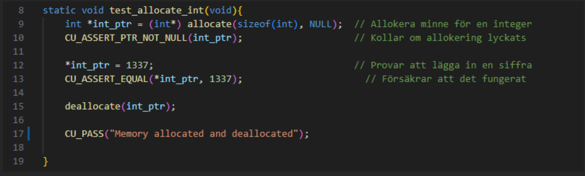
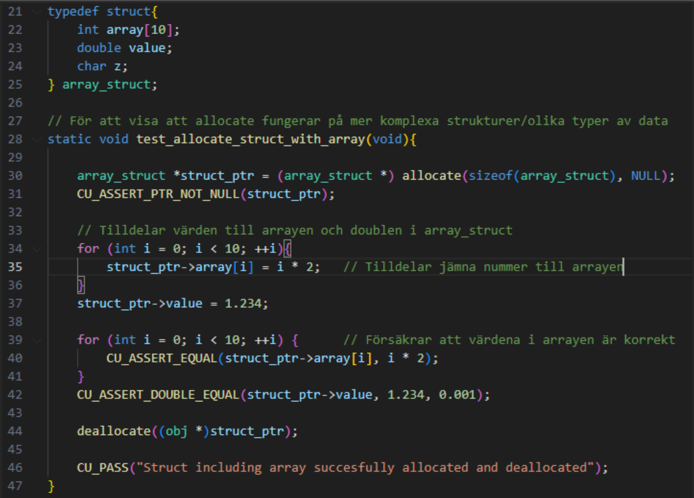
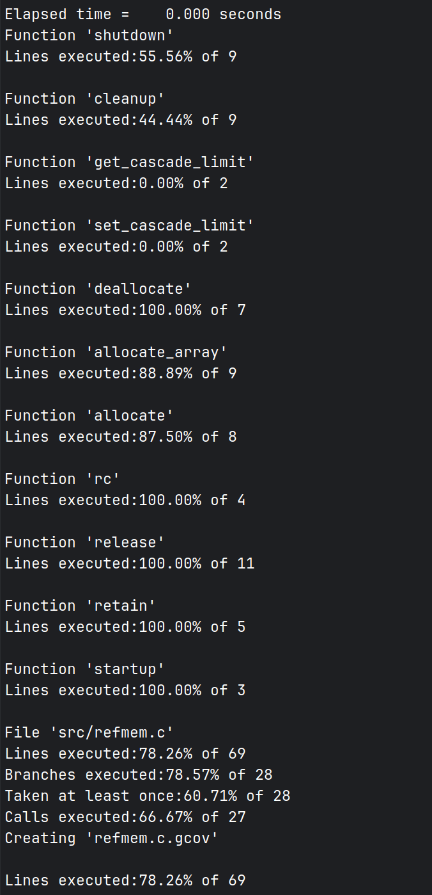

# Test report SEGFAULT

## Unit testing
Initially the idea was to use a test-driven development process where regression testing would be used, however one of the responsible members for writing the tests got sick. So, we decided to write the tests last. In our development process the creation of tests followed the actual implementation of our functions. The initial phase of our workflow involved coding the functions based on requirements described in the project. Changing our workflow to prioritize function implementation allowed us to start coding without the constraint of writing tests.

The actual writing of the tests went smoothly. Using C Unit for writing tests turned out to be easier and more straightforward than we would’ve thought. We believe this is largely due to the well documented function descriptions accompanying each function. Understanding the intended behaviour such as inputs and outputs of the function made crafting targeted tests easy. It was difficult to write tests for some of the functions however, specifically those where malloc returns “NULL”, more on that in the code coverage section of this report.

Two tests will be displayed and explained below to provide an understanding of what the tests do and how straightforward C Unit is:

The purpose of the test “test_allocate_int” is to verify that memory is actually allocated and making sure that writing to that adress is working. The first row in the test function allocates memory the size of an int in int_ptr. The second row uses CU_ASSERT_PTR_NOT_NULL to make sure that int_ptr is not NULL, it should contain a memory address. The third row writes 1337 to the adress of int_ptr. The fourth row makes sure what's written on the address of int_ptr is 1337. The fifth row then deallocates the memory to clean up. The sixth row uses CU_PASS prints the text “Memory allocated and deallocated”.

To summarize the tests usually starts off with one of the functions we have written in the project being used, thereafter with the use of different versions of CU_ASSERT the result of the function is being controlled. A more complicated test where allocate uses a struct with an array will be shown below, as you will see the general structure or use of C Unit remains very similar.

This test was written to verify that allocate also works with more complicated structures using different types of data. First a struct is defined, which contains an int “array” with 10 entries, a double “value” and a char “z”. Then allocate is used and stored in struct_ptr. Values for the array is given using a for-loop, which just loops through the array and assigns values depending on i. A double value is also assigned (1.234).

Now that memory has been allocated using allocate for the struct, and values have been assigned for both the array and the double, this must now be controlled. Using a for loop once again CU_ASSERT_EQUAL is used to make sure the values in the array are correct.  CU_ASSERT_DOUBLE_EQUAL is used to assert the double value. Thereafter deallocate is used to free the memory.

## Integration testing
The library is integrated with two different demo programs. The first program is a command-line webstore that can be used to keep track of goods in a warehouse through a database backend and a command-line interactive frontend. It also utilizes internal implementations of a linked list, linked list iterator, and a hash table. All these implementations utilize the refmem library. The webstore demo also contains unit tests for the internal logic. To ensure that the integration was successful and that the demo worked as intended we used the original tests from assignment one and two. If those tests passed, we could be sure that the integration of our program did not remove the original functionality of the demo. The already existing tests for the warehouse allowed us

Default destructor uses the typemem library which is a plugin of the refmem files.

## Regression testing
As the principle of test-driven development was not faithfully applied to the development process, there were no traditional tests present during a significant portion of the projects progress. However, the introduction of the first demo implementation of the webstore backend was introduced into the master branch very early. This includes the webstore’s unit tests and the unit tests of its internal libraries, making it a rather comprehensive consumer of the refmem library.

Due to the very late addition of the traditional unit tests as mentioned before, the first demo became the primary way to verify the absence of regressions during the followed development of the library, including some drastic changes like the decoupling of the metadata handling code from the core refmem library. The demo was thus extensively run using the convenient Makefile after every change was made, including small changes due to their small execution time on modern hardware.

As a result of this, the first demo implementation effectively became the main form of regression testing.

The second demo showcasing the default destructors of the typemem plugin also became an important form of regression testing. It was used to solve a rather nasty bug that appeared after refactoring the default destructor function, where memory would not be freed. This bug is explained in greater detail further down.

## Code coverege
Please note that full code coverage in our case cannot realistically be reached for the allocation functions ‘allocate’ and ‘allocate_array’. This is because we cannot simulate a scenario where ‘malloc’ or ‘calloc’ returns ‘NULL’, which usually only happens when the system runs out of memory. If we had the time, we could perhaps utilize a container format such as docker to impose a lower memory limit. However, all the functions which we can test fully, have 100% code coverage.

Furthermore, a project member did not hand in the code for the functions ‘get_cascade_limit’ and ‘set_cascade_limit’. These are not implemented in the project at all, and because of this, they had no code coverage. The shutdown and cleanup functions were additionally only partially executed. The code that is not executed is responsible for freeing objects kept track of internally in the linked list for object pointers. This code path is not executed because of the absence of the cascade limit code that is supposed to insert object references in this list, to later be freed by the ‘shutdown’ and ‘cleanup’ functions.

## Notable bugs

### Non-nullable destructor function pointers

Our first notable bug, and [the only one reported on the issue tracker](https://github.com/IOOPM-UU/SEGFAULT/issues/22), was a bug in which when a null function pointer was passed into the allocation function, indicating that no destructor is needed for the objects, the deallocation function would not check if this function pointer was indeed a null pointer and run the destructor unconditionally. This in turn causes a segmentation fault, making it necessary to use dummy destructors for the webstore demo implementation. This was remedied by checking if the function pointer for the destructor is not null and only in that case call said function on the object to free. 

### Public function name clashing

When integrating the webstore demo implementation with the refmem library, it was found that the usage of two versions of the library from assignment 1 in the IOOPM course caused the public function identifiers in said libraries to clash and cause errors during the linking stage of a build. It is needed to use two different versions of this library as one is internal to refmem and should be left unmodified, while the other is used in the webstore demo and should be adapted to utilize the refmem library. This was remedied by refactoring all public functions in the demo version by appending a “_demo” postfix.

### Use of uninitialized values

When the hash table implementation in the webstore demo creates a hash table, it set all member variables of the hash table struct to explicit values, except for the buckets array. This was not a problem with “calloc” as it explicitly sets all allocated data to zeroes, the allocate function, according to specification, does not do this. This caused Valgrind to report that uninitialized values were created by a heap allocation. This was remedied by doing a memset of zeroes on the hash table bucket array manually as a consumer of the library.

### Hidden memory allocations incompatible with refmem

The webstore demo implementation makes wide use of the POSIX “strdup” function. The problem with this function is that it contains hidden memory allocation. When all references to calloc, malloc, and free, were replaced. Some deallocation calls to the refmem library failed as it was trying to free memory allocated by strdup, which is incompatible with the refmem library. This was remedied by creating a custom string duplication function internal to the demo that utilizes the refmem library. Then, all occurrences of strdup were replaced with said function.

### Non-null-terminated function pointer arrays

The unit tests of the refmem library were split into separate files for each public function, where each file contains a function that returns an array of function pointers to the individual unit tests. The function pointer arrays were statically defined in each file, and the main unit test logic retrieves this array and executes each function in it until it reaches a null terminator. The problem in this case was that statically declared arrays, contrary to strings, are not automatically null-terminated by the compiler, which caused the iterator to overshoot and call arbitrary addresses often resulting in a segmentation fault. This was remedied simply by appending a null pointer to the end of the function pointer array.

### Incorrect pointer casting causes memory errors

As mentioned previously, when implementing the typemem plugin, the default destructor function did not free memory correctly due to incorrect pointer casting. This incorrect code was an outcome of us trying to conform to compiler warnings discouraging void pointer arithmetic. This bug caused many hours of debugging before being pinned down, upon which it was determined that void pointer arithmetic was strictly necessary in this case due to the design of the core refmem library. The pointer arithmetic warning flag was explicitly disabled for the source file in question, and the code modified to utilize void pointer arithmetic again, which solved the memory leakage problems. If it is explicitly stated that this is a dangerous operation, it is acceptable utilize it, provided that the engineer is informed about what the code does. 

 
